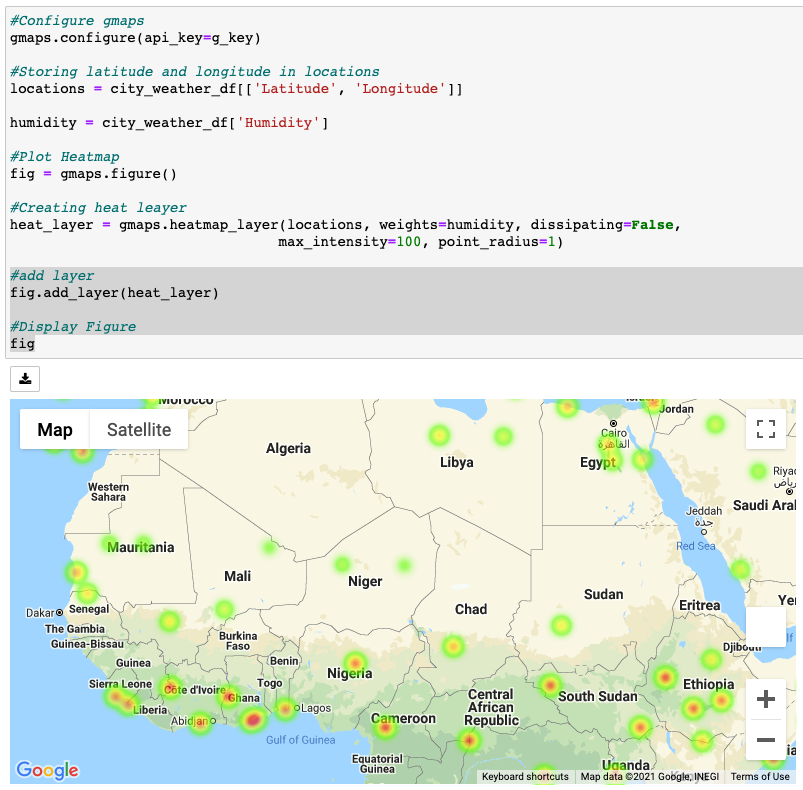
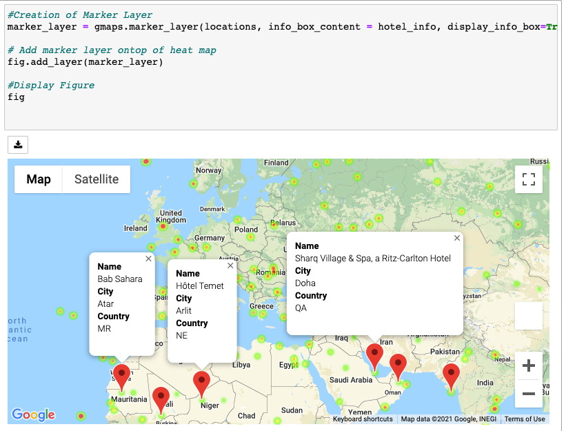

# Python API's Challenge

## Table of Contents
#
1. Background
2. File Description
3. Technologies

## Background
#

## Part I - WeatherPy
For this part of the challenge, we create a Python script to visualize the weather of 500+ cities across the world of varying distance from the equator. To accomplish this, we utilize a [simple Python library](https://pypi.python.org/pypi/citipy), the [OpenWeatherMap API](https://openweathermap.org/api), and a little common sense to create a representative model of weather across world cities.

The first requirement was to create a series of scatter plots to showcase the following relationships:

* Temperature (F) vs. Latitude
* Humidity (%) vs. Latitude
* Cloudiness (%) vs. Latitude
* Wind Speed (mph) vs. Latitude

The second requirement was to then run linear regression on each relationship. This time, we separate the plots into Northern Hemisphere (greater than or equal to 0 degrees latitude) and Southern Hemisphere (less than 0 degrees latitude).

The final notebook must:

* Randomly select **at least** 500 unique (non-repeat) cities based on latitude and longitude.
* Perform a weather check on each of the cities using a series of successive API calls.
* Include a print log of each city as it's being processed with the city number and city name.
* Save a CSV of all retrieved data and a PNG image for each scatter plot.

The final results of this notebook resembles the following:

## Part II - VacationPy
In this section, we used jupyter-gmaps and the Google Places API.

To complete this part of the assignment, we needed to do the following:

* Create a heat map that displays the humidity for every city from Part I.

* Narrow down the DataFrame to find your ideal weather condition. For example:

  * A max temperature lower than 80 degrees but higher than 70.

  * Wind speed less than 10 mph.

  * Zero cloudiness.

  * Drop any rows that don't contain all three conditions. You want to be sure the weather is ideal.

* Using Google Places API to find the first hotel for each city located within 5000 meters of your coordinates.

* Plot the hotels on top of the humidity heatmap with each pin containing the **Hotel Name**, **City**, and **Country**.

Results of this notebook, resemled the following:

## File Descriptions
#
File name: CityWeather.csv

The dataset is composed of 9 columns:

- City
- Latitude
- Longitude
- Max_Temps
- Humidity
- Cloudiness
- Wind_Speed
- Country
- Date

## Technologies
#
Scripts were created in Jupyter Notebook (Version 6.3.0). 

Applied use of the following Dependencies:

- Matplotlib
- Pandas
- Numpy
- Requests
- Time
- Scipy
- JSON
- Citypy
- GMAPS
- OS

